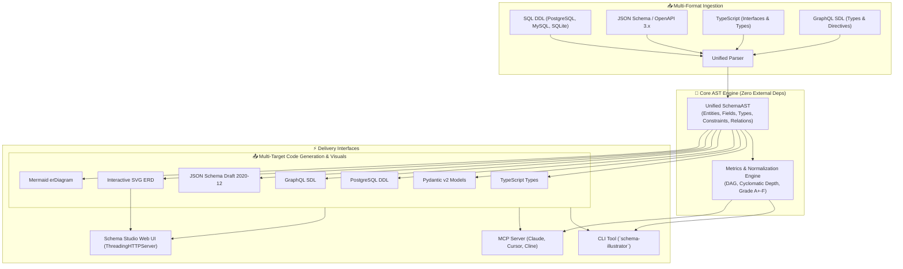

# 🎨 Schema Illustrator Studio

[](https://github.com/1nc0gn30/schema-illustrator-studio/actions/workflows/ci.yml)
[](https://www.python.org/)
[](https://opensource.org/licenses/MIT)
[](pyproject.toml)
[](src/schema_illustrator_studio/mcp_server.py)
[](public/index.html)

**Schema Illustrator Studio** is a pure-Python, zero-dependency universal schema visualization, transpilation, ERD generation, and quality metrics engine. It seamlessly converts between **JSON Schema**, **SQL DDL**, **TypeScript Interfaces**, and **GraphQL SDL**, generates interactive **SVG Entity-Relationship Diagrams (ERD)** with cubic Bezier relation routing, computes comprehensive **normalization & complexity metrics**, provides an MCP server for AI coding assistants, and ships a **Web Studio UI (design influenced by Material 3)**.

---

## 🏛️ Architecture Overview



---

## ✨ Key Features

| Capability | Description |
| :--- | :--- |
| **Zero Runtime Dependencies** | 100% Python Standard Library implementation (`dataclasses`, `enum`, `http.server`, `re`, `json`). |
| **Universal Ingestion** | Ingest SQL DDL, JSON Schema, OpenAPI 3.x, TypeScript interfaces, or GraphQL SDL with automatic format detection. |
| **Multi-Target Transpiler** | 1-click conversion to TypeScript, Pydantic v2 (`BaseModel`, `Field`), PostgreSQL DDL, GraphQL SDL, or JSON Schema. |
| **Interactive SVG ERD Engine** | Generate publication-ready SVG diagrams with table cards, primary key badges, foreign key references, and cubic Bezier connectors. |
| **Quality & Complexity Metrics** | Calculate normalization score, circular dependencies, orphan entities, depth, fan-in/fan-out, and overall schema grade (A+ to F). |
| **Material 3 Web UI** | Modern dual-pane web studio (design influenced by Material 3) with live syntax tabs, draggable SVG canvas, zoom/pan controls, and transpiler drawer. |
| **Model Context Protocol (MCP)** | Native JSON-RPC 2.0 MCP server over stdio for Claude Desktop, Cursor, Cline, and Windsurf. |
| **Cross-Platform** | Fully verified on Linux (Ubuntu/Debian/Parrot), macOS, Windows, and Termux/Android. |

---

## 🚀 Quick Start

### Installation

```bash
# Clone the repository
git clone https://github.com/1nc0gn30/schema-illustrator-studio.git
cd schema-illustrator-studio

# Install in editable mode
pip install -e .
```

### 1. Launch Schema Studio Web UI

```bash
# Starts local UI server at http://127.0.0.1:8765
schema-illustrator serve --open
```

### 2. Transpile Schemas via CLI

```bash
# Convert SQL DDL to Pydantic v2 Models
schema-illustrator transpile schema.sql --target pydantic --output models.py

# Convert JSON Schema to TypeScript
schema-illustrator transpile schema.json --target typescript

# Convert TypeScript interfaces to PostgreSQL DDL
schema-illustrator transpile types.ts --target sql
```

### 3. Generate ERD Diagrams

```bash
# Export publication-ready SVG diagram
schema-illustrator erd schema.sql --output diagram.svg

# Export Mermaid erDiagram syntax for Markdown
schema-illustrator mermaid schema.sql
```

### 4. Analyze Schema Quality & Metrics

```bash
schema-illustrator metrics schema.sql
```

---

## 🤖 Model Context Protocol (MCP) Integration

`schema-illustrator-studio` ships with a built-in JSON-RPC 2.0 MCP server over `stdio`.

### Registered MCP Tools

| MCP Tool Name | Description |
| :--- | :--- |
| `schema_parse` | Ingest raw schema (SQL, JSON Schema, TS, GraphQL) and return structured AST. |
| `schema_transpile` | Convert schema into target code (`typescript`, `pydantic`, `sql`, `graphql`, `json-schema`). |
| `schema_export_erd` | Generate standalone SVG ERD diagram or Mermaid ER diagram from schema. |
| `schema_metrics` | Analyze schema complexity, normalization grade, depth, and circular dependencies. |
| `schema_sample_templates` | Retrieve built-in production schema templates (E-Commerce, Auth, Social, SaaS). |
| `schema_diagnostics` | System and parser diagnostics. |

### Claude Desktop Configuration

Add to `~/Library/Application Support/Claude/claude_desktop_config.json` (macOS) or `%APPDATA%\Claude\claude_desktop_config.json` (Windows):

```json
{
  "mcpServers": {
    "schema-illustrator": {
      "command": "python",
      "args": ["-m", "schema_illustrator_studio.cli", "mcp"]
    }
  }
}
```

### Cursor Configuration

Add to `.cursor/mcp.json`:

```json
{
  "mcpServers": {
    "schema-illustrator": {
      "command": "schema-illustrator",
      "args": ["mcp"]
    }
  }
}
```

### Cline / Roo-Code Configuration

Add to `cline_mcp_settings.json`:

```json
{
  "mcpServers": {
    "schema-illustrator": {
      "command": "python3",
      "args": ["-m", "schema_illustrator_studio", "mcp"]
    }
  }
}
```

---

## 💻 CLI Reference

```text
usage: schema-illustrator [-h] [-v] [--no-color] <command> ...

Universal Schema Illustrator, Transpiler, ERD & Metrics Studio.

commands:
  parse       Parse a schema file or string into AST JSON
  transpile   Transpile schema to TypeScript, Pydantic, SQL, GraphQL, or JSON Schema
  erd         Generate SVG ERD diagram or ASCII summary table
  mermaid     Export schema as Mermaid erDiagram markdown syntax
  metrics     Analyze schema complexity, normalization score, and DAG depth
  samples     List or output built-in production schema templates
  serve       Launch the Schema Studio Web UI (design influenced by Material 3)
  mcp         Run the Model Context Protocol (MCP) server over stdio
  doctor      Display system environment and parser capability diagnostics
  test        Execute internal test suite
```

### CLI Subcommand Examples

```bash
# Parse with explicit or auto format
schema-illustrator parse schema.sql --format sql --json

# Transpile to Pydantic v2
schema-illustrator transpile schema.json --target pydantic

# Generate SVG ERD with dark theme
schema-illustrator erd schema.sql --theme dark --output erd_dark.svg

# Output Mermaid markdown
schema-illustrator mermaid schema.graphql

# Run Schema Quality Doctor
schema-illustrator metrics schema.sql

# Launch Web UI on custom port
schema-illustrator serve --host 0.0.0.0 --port 9000
```

---

## 🐍 Python Library API

```python
from schema_illustrator_studio import (
    parse_schema,
    transpile_schema,
    export_erd_svg,
    export_mermaid_erd,
    analyze_schema_metrics,
)

sql_source = """
CREATE TABLE users (
  id UUID PRIMARY KEY,
  email VARCHAR(255) NOT NULL UNIQUE
);

CREATE TABLE posts (
  id UUID PRIMARY KEY,
  user_id UUID NOT NULL REFERENCES users(id),
  title VARCHAR(200) NOT NULL
);
"""

# 1. Parse into Unified AST
ast = parse_schema(sql_source, format_hint="sql")
print(f"Parsed {len(ast.entities)} entities and {len(ast.relationships)} relationships.")

# 2. Transpile to Pydantic v2
pydantic_code = transpile_schema(ast, target="pydantic")
print(pydantic_code)

# 3. Transpile to TypeScript
ts_code = transpile_schema(ast, target="typescript")
print(ts_code)

# 4. Generate SVG ERD
svg = export_erd_svg(ast, theme="light")

# 5. Analyze Quality & Normalization
metrics = analyze_schema_metrics(ast)
print(f"Grade: {metrics.grade} | Complexity: {metrics.complexity_score}")
```

---

## 🧪 Running Tests

```bash
# Run pytest test suite
pytest tests/ -v

# Run internal test command
schema-illustrator test
```

---

## 📄 License

This project is licensed under the **MIT License**. See [LICENSE](LICENSE) for details.
